# 业务督导中心数智管理平台

本项目是一套面向业务督导、站点整改和管理分析的综合平台。系统以巡检业务为主线，同时提供考核、培训、站点主数据、数据备份、系统安全和 AI 分析等能力。

> 本文档以当前代码中的实际逻辑为准，重点说明巡检系统的功能和状态流转。

## 文档导航

- [技术架构](#技术架构)
- [系统功能全景](#系统功能全景)
- [巡检系统](#巡检系统)
- [巡检主流程](#巡检主流程)
- [权限与数据范围](#权限与数据范围)
- [数据一致性与追溯](#数据一致性与追溯)
- [本地运行与验证](#本地运行与验证)
- [AI 报告记忆与生成日志](docs/report-ai-memory.md)

## 技术架构

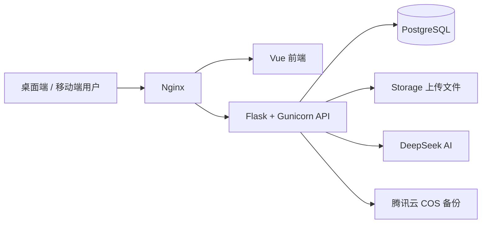

| 层级 | 主要技术 | 职责 |
| --- | --- | --- |
| 前端 | Vue 3、Vue Router、Axios、Vite | 页面交互、权限导航、移动端适配 |
| 后端 | Flask、Gunicorn | 身份校验、业务规则、文件处理、后台任务 |
| 数据库 | PostgreSQL、Flask-Migrate / Alembic | 业务数据、权限、状态和历史记录 |
| 文件 | 本地 Storage、腾讯云 COS | 问题照片、整改照片、原件、材料和备份 |
| AI | DeepSeek 兼容 API | 规范匹配、反馈标题、报告分析和文稿生成 |

## 系统功能全景

```mermaid
flowchart TB
    ROOT[业务督导中心数智管理平台]

    ROOT --> MAP[地图中心]
    ROOT --> INS[巡检系统]
    ROOT --> ASS[考核系统]
    ROOT --> TRA[培训系统]
    ROOT --> PUB[公共功能]
    ROOT --> MGT[管理系统]

    INS --> REG[巡检登记]
    INS --> ISTD[巡检规范库（内部）]
    INS --> ESTD[检查表原件库（外部）]
    INS --> ISSUE[巡检问题列表]
    INS --> RECORD[巡检记录]
    INS --> MINE[我的待整改 / 待复核]
    INS --> PLAN[巡检计划与派工]
    INS --> REPORT[AI 报告生成]
    INS --> CERT[证照管理]

    ASS --> ATT[人员出勤]
    ASS --> SCORE[站点评分]
    ASS --> PEER[成员互评]

    TRA --> MATERIAL[培训材料库]
    PUB --> FEEDBACK[系统反馈]

    MGT --> USER[用户与权限]
    MGT --> STATION[站点数据]
    MGT --> CHECKLIST[检查表数据]
    MGT --> INTERNAL[内部规范数据]
    MGT --> COMPLETE[巡检封存管理]
    MGT --> AUTOAUDIT[白名单自动审核]
    MGT --> SECURITY[系统安全]
    MGT --> BACKUP[数据备份]
```

## 巡检系统

### 核心业务对象

| 对象 | 含义 | 关键关系 |
| --- | --- | --- |
| 站点 | 巡检和整改的业务主体 | 关联片区、站点账号、证照、计划和巡检记录 |
| 检查表 | 来自外部原件的结构化检查内容 | 每张表包含动态字段和多条外部规范 |
| 外部规范 | 由检查表原件拆解得到的规范 | 每条拥有全局唯一的外部规范 ID |
| 内部规范 | 业务督导中心归纳形成的巡检规范 | 一条内部规范可挂载多条外部规范 |
| 巡检记录 | 某站点在某个周期内对某张检查表的一次巡检载体 | 一条记录可包含多个问题和多名检查人 |
| 巡检问题 | 检查人引用规范后登记的实际问题 | 必须归属站点、检查表、外部规范、巡检记录和提交人 |
| 巡检计划项 | 某张检查表在计划周期内对某站点的任务 | 可分配多名检查人，通过已确认完成的巡检记录判定完成 |

### 规范体系与引用逻辑

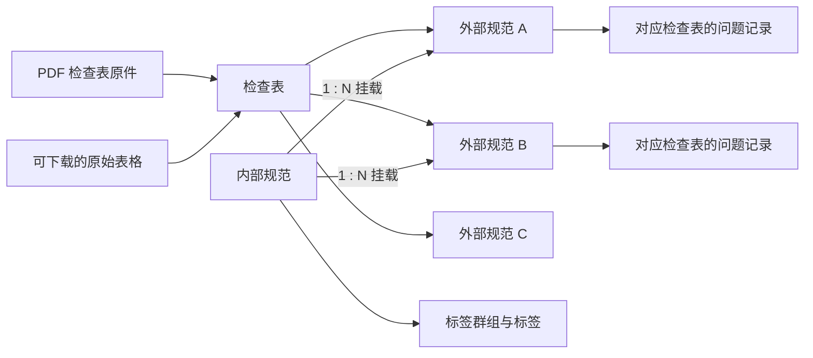

规范引用遵循以下原则：

1. 外部规范始终归属一张具体检查表，是问题进入巡检记录和报告统计的最终落点。
2. 一条内部规范可同时挂载多条外部规范，但一条外部规范不能同时归属多条内部规范。
3. 使用内部规范登记时，系统按挂载关系展开为对应的外部规范问题。一条内部规范挂载多条外部规范时，可在不同检查表记录下生成对应问题。
4. 问题列表同时展示内部与外部规范信息；巡检记录仍以外部规范和检查表为统计依据。
5. 系统可在管理端切换巡检登记使用内部规范还是外部规范。

### 巡检登记

巡检登记分为“发现问题”和“未发现问题”两种入口：

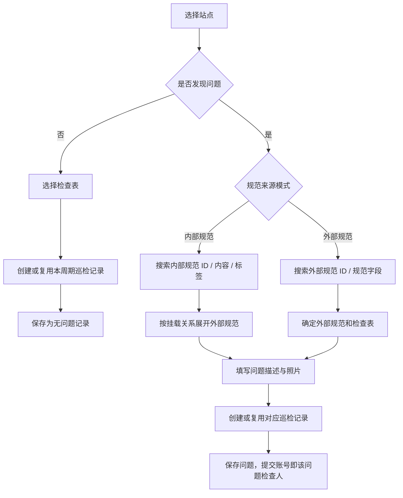

登记阶段的主要规则：

1. 默认按“自然月”控制同站点、同检查表的巡检记录唯一周期；管理员可改为自然周、自然季度或自然年。
2. 在当前周期的记录尚未确认完成时，后续提交会继续进入同一条巡检记录，不会重复新建。
3. 记录确认完成后，当前周期不再允许新增问题；进入新周期后可创建新记录。
4. 同一条巡检记录可包含多名检查人。每条问题的检查人是实际提交该问题的账号，不会统一挂到第一名检查人。
5. 问题照片支持选择、拖拽和粘贴，最多选取 3 张后进行裁剪、位置调整、画圈标注和自动拼接；最终以一张合成图保存。
6. 页面提供本地草稿自动保存和恢复，会话即将过期时会提前提示用户。

## 巡检主流程

### 端到端流程图

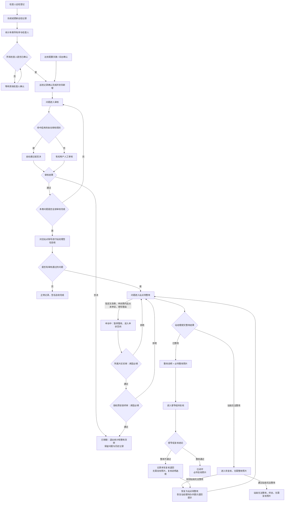

### 巡检记录状态

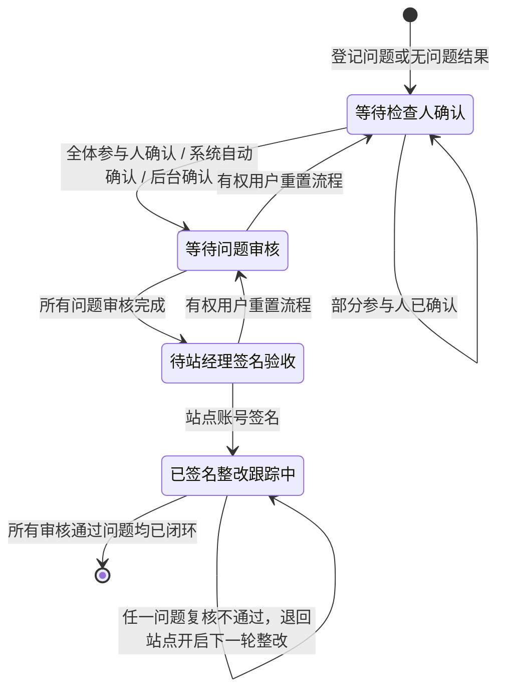

记录确认与封存规则：

| 规则 | 系统行为 |
| --- | --- |
| 多人参与 | 任意一人确认只记录本人进度，必须所有参与检查人均确认后才算完成 |
| 自动确认 | 默认超过 7 天自动确认；管理员可设置 1-31 天或关闭自动确认 |
| 完成效果 | 封存当前周期的新增入口，同步巡检计划任务完成情况，然后才允许问题审核 |
| 已有问题编辑 | 检查人确认完成本身不会取消已有问题的编辑权；问题审核后则需先重置为待审核才能继续编辑 |
| 流程重置 | 只有具备“重置巡检记录流程”权限的用户可操作，并会清除关联问题的审核结果 |
| 签名后限制 | 站经理签名验收后不允许再重置巡检记录流程 |
| 删除记录 | 删除巡检记录会级联删除该记录下的巡检问题，并重新计算相关计划完成状态 |

### 问题审核状态

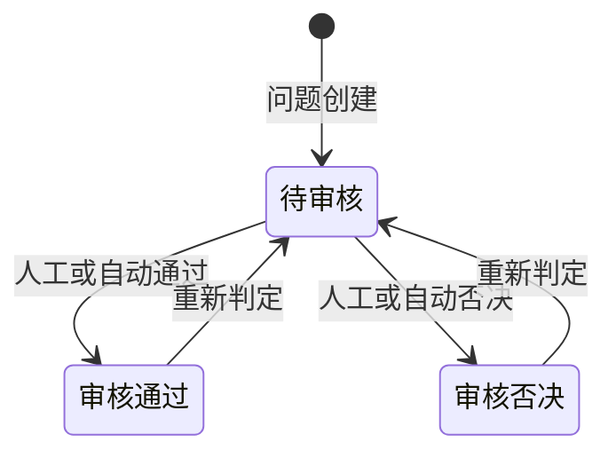

1. 问题所属巡检记录尚未确认完成时，不允许审核。
2. 自动审核只使用唯一外部规范 ID 进行全匹配，所有规则平级，可分别配置自动通过或自动否决。
3. 审核否决的问题不参与巡检记录异常数量、整改复核流转和后续报告数据。
4. 审核否决时系统会取消该问题的“优秀问题”标记。
5. 问题一旦审核，提交人的通用编辑与删除权限暂停；审核人重置为待审核后才可再次编辑。

### 单条问题整改复核状态

问题在“审核状态”之外，还有一套用于站点整改和督导复核的业务状态。页面会结合审核和巡检记录签名状态，展示用户容易理解的文案。

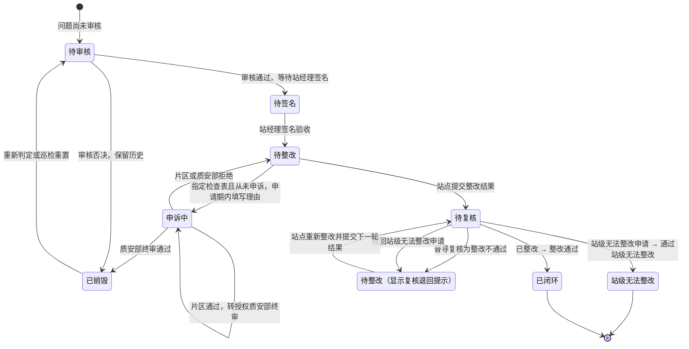

| 操作阶段 | 可选结果 | 说明要求 | 照片要求 | 下一状态 |
| --- | --- | --- | --- | --- |
| 站点整改 | 已整改 | 必填 | 必传整改照片 | 待复核 |
| 站点整改 | 站级无法整改 | 必填 | 无需照片 | 待复核 |
| 督导复核（站点已整改） | 整改通过 | 选填 | 必传复核照片 | 已闭环 |
| 督导复核（站级无法整改申请） | 通过站级无法整改 | 选填 | 无需照片 | 站级无法整改（终态） |
| 督导复核（站级无法整改申请） | 驳回站级无法整改 | 选填 | 无需照片 | 待整改，恢复站经理待办 |
| 督导复核 | 整改不通过 | 选填，建议说明退回原因 | 无需照片 | 待整改，恢复站经理待办 |

> v6.2 恢复站级无法整改申请和终态。此前 v6.1 已迁回待整改的问题不自动重新结案，需要站点重新提交申请并由督导复核。已销毁不是物理删除，可通过重新判定恢复。

问题流转记录遵循以下原则：

1. 登记、巡检完成确认、人工/自动审核及重新判定、签名及撤销、问题修改和状态调整均纳入流转记录。历史审核只补回数据库中仍存在的最后一次结论，不虚构早期事件。每次“提交整改”和“提交复核”都写入独立历史记录，保留轮次、操作人、时间、前后状态、结果、说明和照片。
2. “整改不通过”不是终态：问题从“待复核”恢复为“待整改”，重新出现在对应站点账号的待办中，并显示上一轮退回原因和退回时间。
3. 站点重新提交整改时进入下一轮“待复核”；当前复核展示字段会为新一轮清空，但上一轮结果、说明和照片（如有）继续保存在历史记录中。
4. 巡检记录只有在全部审核通过问题都“已闭环”或“站级无法整改”后，才完成整改跟踪；存在被退回或待复核问题时仍处于跟踪中。
5. “我的待整改 / 待复核”和“巡检问题列表”均可查看完整流转时间线，站点账号只能处理本站被退回的问题。

### 巡检计划与派工

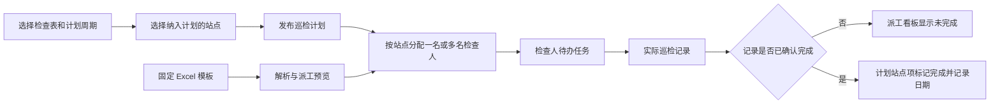

计划逻辑：

1. 计划只有未完成和已完成，不存在草稿状态；创建后即生效，但可随时修改。
2. 同一张检查表的月度、季度和年度覆盖计划不并存；切换周期需经用户确认。
3. 一个站点任务可分配多名检查人，分配时间和人员都会保存，用于派工看板和待办提醒。
4. 线上检查表不能向“监控未运行”的站点派发视频巡检任务；线下检查表不受此限制。
5. 计划任务的完成依据是计划时间段内同站点、同检查表的巡检记录已确认完成，而不是简单的手工勾选。
6. 管理计划、检查表范围和片区范围均受服务端权限校验。

### 主要页面与职责

| 页面 | 主要职责 |
| --- | --- |
| 巡检登记 | 选择站点、引用内部或外部规范、登记问题或无问题结果 |
| 巡检规范库（内部） | 查看内部规范、标签和所挂载的外部规范，支持筛选和 PDF 导出 |
| 检查表原件库（外部） | 预览 PDF 原件，下载原始表格，查看和导出检查表拆解得到的外部规范 |
| 巡检问题列表 | 按数据范围查询问题，审核、编辑、删除、更换检查人、设置优秀问题、查看整改退回状态与完整流转记录、后台导出 |
| 巡检记录 | 按站点与检查表查看检查结果、参与人进度、问题审核进度、站经理签名和整改进度 |
| 我的待整改 / 待复核 | 站点提交已整改或站级无法整改申请；督导按对应分支通过或驳回，驳回后退回站点；流转记录单独查看 |
| 巡检计划 | 查看计划总览、历史完成情况、任务分配、派工看板和个人待办 |
| AI 报告生成 | 按报告类型和时间范围汇总已完成记录与审核通过问题，异步生成报告并导出 PPT |
| 证照管理 | 维护站点证照有效期，按证照规则生成正常、推荐提醒、法定提醒和已过期状态 |

### 管理端对巡检系统的支撑

| 管理功能 | 作用 |
| --- | --- |
| 检查表数据管理 | 新建、编辑、删除检查表，维护动态字段和外部规范 |
| 巡检规范库数据管理 | 维护内部规范、标签群组、标签和外部规范挂载关系 |
| 巡检封存管理 | 配置记录唯一周期、自动确认天数，查看并管理巡检记录完成状态 |
| 白名单自动审核管理 | 按唯一外部规范 ID 设置平级的自动通过 / 否决规则，并提供回溯导出 |
| 用户数据管理 | 分配页面、操作、数据范围、检查表范围和片区范围权限 |
| 页面显示管理 | 全局显示或隐藏页面；某子系统下页面全部隐藏时，同步隐藏子系统菜单 |

## 权限与数据范围

前端菜单隐藏只用于改善交互，最终安全判断由后端根据签名会话中的当前用户执行。

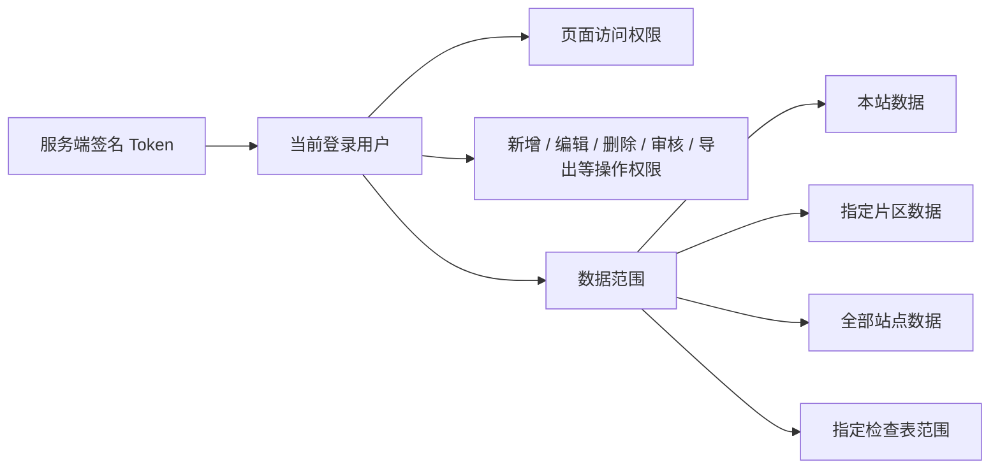

权限原则：

1. `root` 拥有全部权限，其他角色使用“角色通用权限 + 用户个性化权限”的模式。
2. 用户存在个性化权限时，个性化权限优先于角色通用权限。
3. 本站、片区和全部站点是互斥的主数据范围，可叠加检查表范围限制。
4. 站点账号和片区账号默认不查看待审核问题，只在问题完成审核后进入其可见范围。
5. 检查人姓名和手机号可通过独立权限对特定角色隐藏。
6. 已闭环问题原则上不可修改或删除，只有 `root` 可在必要时使用管理权限处理。

## 数据一致性与追溯

1. 外部规范 ID 是规范的全局唯一标识，已被业务数据引用的规范不允许删除，但可修改内容并在关联页面中同步展示最新内容。
2. 巡检问题保留问题照片，以及每轮实际提交的整改/复核照片和对应时间；“整改不通过”无需复核照片。
3. 整改和复核采用追加历史记录，逐轮保留操作人、状态变化、结果、说明和照片，不会因复核退回或再次提交而丢失上一轮信息。
4. 删除问题会同步更新巡检记录结果和相关计划完成情况；删除巡检记录会级联删除其下问题。
5. AI 报告主要使用已确认完成的巡检记录和审核通过的问题，AI 生成内容在页面和导出结果中应带有明确标识。

## 本地运行与验证

```bash
# 构建并启动本地开发环境，后端启动时会自动应用 Alembic 迁移
docker compose up --build

# 前端构建验证
cd frontend
npm run build

# 后端测试
docker compose run --rm --no-deps backend \
  python -m unittest discover -s tests -p 'test_*.py'

# 检查数据库迁移状态
docker compose exec backend python -m flask db current
docker compose exec backend python -m flask db heads
```

## 文档维护约定

涉及以下变更时，应同步更新本 README：

1. 巡检记录确认、问题审核、签名、整改或复核状态变更。
2. 内部与外部规范映射关系变更。
3. 巡检计划周期、派工或完成判定变更。
4. 巡检页面权限、数据范围或角色默认权限变更。
5. 巡检记录或问题的删除、重置和级联处理规则变更。

### v6.1 流转升级说明

部署时执行 Alembic 升级至 `20260905_001`，增加事务内生命周期触发器并补录可恢复的历史审核、完成确认和签名。迁移可重复执行；回退仅移除触发器，不删除审计证据或逆转用户后续的整改状态。流转查询为只读，提交整改/复核单独操作；已提交整改照片不再提供单独替换接口。

### v6.2 流转升级说明

部署时执行 Alembic 升级至 `20260905_002`。迁移将审核否决的问题标记为已销毁，统一历史复核通过名称，并完善巡检重置事件；可重复执行，不删除问题或历史记录。降级不反向修改业务状态或删除流转证据，旧版应用不支持新增复核分支，不建议仅回退代码。站级无法整改申请通过后保留为独立终态，驳回后返回待整改。站点提交整改弹窗不再加载或展示流转记录，请通过“查看流转”单独查询。

### v6.4 申诉空间

部署前执行 Alembic 升级至 `20260905_003`。新增申诉表、同一问题仅一条进行中申诉的唯一索引，以及流程重置时取消申诉的触发器；迁移可重复执行，不改动已有问题。回退不会删除申诉证据，回退旧代码前须先处理完进行中的申诉，避免旧版本无法展示或处理“申诉中”状态。

- 申诉入口位于站点“我的待整改问题”的提交整改下方。仅支持计量稽查检查表（视频/现场）、环境无异味管理检查表（现场）、质量安全环保检查表（视频/现场），且问题须审核通过、已签名验收并处于待整改。
- 申诉理由必填；提交后暂停整改并跳转“申诉空间”。任何用户都可访问菜单，但站点只看本站，片区仅看配置管理片区，质安部查看申诉，其他角色沿用原问题数据范围。
- 片区默认可初审所管站点，管理范围沿用用户数据管理的“巡检问题列表 → 站点所属地范围”，未配置范围不授予全区审核权。片区通过后转质安部；终审必须是质安部角色且由 root 分配“申诉空间 → 质安部申诉终审”权限。root 可查看与授权，不替代两个业务角色越级审核。
- 两级审核均需原因。任何一级拒绝后回到待整改并显示原因、时间和退回提示；v6.5 起每个问题终身只可申诉一次（拒绝或取消后也不可再次发起）。质安部通过后标记已销毁，同时退出审核通过的数据统计口径，不物理删除。已结束申诉不在待处理列表，保留只读历史查询。
- 发起、初审通过/拒绝、终审通过/拒绝和巡检重置导致的取消全部写入问题流转记录。重复提交、阶段过期及跨站点/片区请求由后端拒绝，不依赖前端隐藏。

### v6.5 申诉提醒与流转优化

部署前将 Alembic 升级至 `20260906_001`，再启用新代码。迁移可重复执行：新增问题申诉占用表和账号已读表，回填所有历史申诉的问题ID；数据库触发器限制新申诉，一次资格不会因单条申诉记录删除而释放。旧版本产生的重复申诉保留，不删除或篡改历史数据。

- 菜单角标为当前账号数据范围内的“进行中申诉 + 已结束未读结果”。进行中查看后仍计数；结束后转为未读，在已结束记录中点击“查看处理结果”才标记本账号已读，其他账号不受影响。已有结束记录初次升级按未读处理。
- 站点/片区/质安部进度卡展示处理阶段、归属、实际审核人或可审核人员；初审通过不代表终审通过。站点申诉失败后回到待整改，显示拒绝原因且不再显示申诉入口。
- 新申诉业务动作与状态变更合为一个流转事件；旧记录只在同一精确时间、同一操作者且状态一致时合并展示。问题审核与申诉审核分栏标识，旧版重复申诉另标次数，底层证据不修改。
- 降级保留申诉占用和已读数据，仅解除一次申诉触发器。恢复旧应用可能重新允许申诉，不建议回退到 v6.4；若重新升级会补齐新产生的占用记录。
- 本地回归：`ISSUE_LIFECYCLE_DB_TEST=1 python -m unittest tests.test_issue_appeals tests.test_issue_lifecycle tests.test_issue_flow_presentation`（在后端目录执行，数据库测试全程事务回滚）；前端执行 `node --test tests/*.test.mjs`。

### v7.0 亮点登记与亮点列表

巡检登记的“是否为亮点登记”默认否；选是后选择站点、检查表，填写亮点描述和照片，共用手机拍照、相册、多图拼接及图片编辑。亮点只写入独立的 `inspection_highlights` 表，使用独立序列显示为 HL1、HL2 等，不占用问题ID，不创建巡检批次、巡检记录、规范关联，也不参与自动审核白名单、统计报告或整改复核。

亮点状态为“待审核 → 已确认亮点 / 审核未通过”，复用问题审核权限及站点、片区、检查表数据范围，审核重置与重新判定记录在 `inspection_highlight_audits`。接口使用服务端登录身份，审核锁定行并校验客户端看到的旧状态；仅当前操作行等待，不阻塞其他亮点审核。亮点列表独立展示，服务端分页、主动筛选，手机使用卡片展示及照片放大。站点/片区待审核可见性和检查人员联系方式隐藏与问题列表一致。

部署需执行 Alembic `20260909_001`，只增加亮点及审核记录表和索引，不迁移或修改现有巡检问题。菜单位于巡检问题列表下方，页面显示管理可独立控制，业务权限沿用巡检问题权限配置。

### v6.9 待复核列表轻量加载

备份维护：COS 使用 16MB 分块、2 路并发和分块 MD5 校验，支持超过 5GB 的备份；云端完整对象大小及列表核对成功后只保留最近 1 份。上传失败不清理旧备份。同地域腾讯云服务器可配置 `COS_USE_INTERNAL=true` 使用 HTTPS 内网域名，默认关闭以兼容本地环境；可在服务器专有的 `docker-compose.override.yml` 中配置（不入库）。

“我的待复核问题”默认不限制月份或日期，仍查看全部历史待复核问题，但只请求当前页（桌面20条、手机5条）。筛选面板采用草稿与已应用条件分离，点击“开始筛选”后由数据库检索全队列；翻页、提交复核后的刷新仍使用已应用条件，末页为空时自动回到有效页码。移动端保留之前的站点选择记忆。

`GET /api/my-issues` 对root、督导组返回分页对象，站点账号保留原待整改数组接口及流转逻辑。新接口 `GET /api/my-issues/filter-options` 单独返回全待复核队列的去重选项，不读取全量问题描述或照片；两个读取均不按客户端用户ID扩大范围。待复核读取移除巡检结构初始化、巡检完成同步和超时批量更新，保留既有权限初始化机制。权限仍沿用原待复核的root/督导组角色范围，不改变复核提交鉴权。

部署需正常运行Alembic迁移 `20260907_001`，增加可重复执行的待复核队列部分索引，不修改任何业务状态。测试覆盖全时间范围、跨页查询、外部规范ID精确匹配、角色鉴权及索引重复执行。

### v6.8 报告字体与翻页优化

六类PPT的正文、表格、图表、母版、主题和内嵌图表工作簿统一只声明微软雅黑（Microsoft YaHei）或宋体（SimSun）。兼容版本升级会重新准备旧成稿的文件与预览，不重新调用AI。移除导出弹窗重复创建入口，正常直接下载与预览一致的文件，仅失败时提供重试。

预览按报告实例缓存最多8页、24MB图片（单张当前页可超过上限），并预加载前1页、后2页，并发上限2。切换成稿或离开页面取消请求并释放URL，不持久保存账号私有图片；页面接口仍检查权限，后端仅验证所请求图片，不再每次遍历整份报告的图片文件。

**部署字体注意：** 微软字体文件不随仓库分发。管理员应将有合法使用授权的微软雅黑及宋体 `.ttf/.ttc` 放入 `storage/report_fonts`，Compose已挂载此目录，后端启动刷新字体缓存。缺少字体时Linux渲染器仍会使用系统替代字体，无法保证网页字形与WPS完全一致；应在部署时用 `fc-match 'Microsoft YaHei'` 和 `fc-match 'SimSun'` 核实匹配，避免误以为仅修改PPT字体声明就已安装字体。

### v6.7 报告PPT兼容性

六类报告统一通过 `backend/pptx_compatibility.py` 处理原生图表、数值缓存、坐标轴和字体。柱形/条形图下方使用独立可编辑的PPT表格，明确写入零值；不删除零值站点，不用非零小数冒充0。图表、内嵌工作簿、文字和表格仍可编辑，导出不是整页图片。

网页默认预览由最终导出的同一份PPT经容器内LibreOffice渲染，使用鉴权图片接口按页加载，不再独立拼装另一套HTML版式。首次准备需要转换时间，不调用AI；`report_ppt_artifacts.py` 按成稿内容、非油源PPT和兼容版本缓存，跨进程锁防止重复转换，转换串行执行避免并发占满资源，同一缓存文件用于预览和下载。导出任务仍按登录用户鉴权，成稿共享规则不变。派生缓存30天未使用后清理，不删除原始成稿；无需数据库迁移。

自动测试覆盖零值、小数、全零图表、可编辑工作簿、六类报告缓存及预览权限；容器内进行了实际渲染检查。不同办公软件仍可能因字体或图表引擎存在差异，旧版/企业版WPS需要在目标环境补充验收，不能保证像素级一致。

### v6.6 质安流程时限管理

仅适用计量稽查检查表（视频/现场）、环境无异味管理检查表（现场）、质量安全环保检查表（视频/现场）。root 通过“管理系统 → 质安流程时限管理”（`/management/quality-deadlines`）分别启用或关闭三个环节的时限、调整天数（1至365的整数），并查询按巡检记录ID、问题ID、事件类型筛选的追溯日志；普通角色不能访问管理接口，身份以服务端当前登录用户为准。以下倒计时流程仅在对应开关启用时执行。

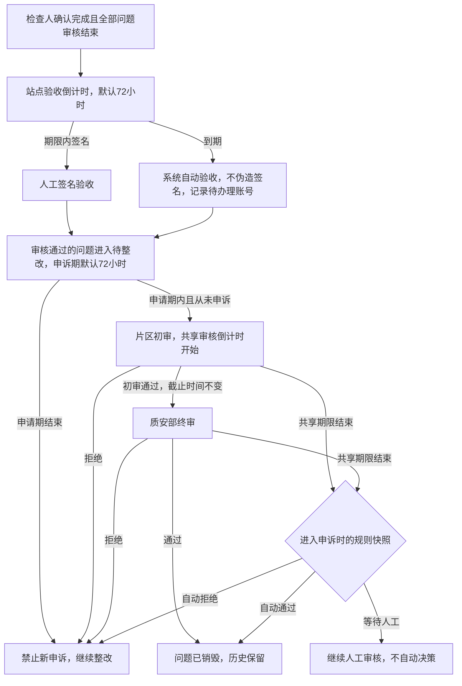

- 验收期限从“检查人确认完成且全部问题审核结束”的时刻起算，不从巡检登记日期倒推；有待审核问题不能自动验收。自动验收保留兼容的已验收状态，以独立来源字段区分，巡检记录支持筛选，所含问题均追加系统自动验收流转记录。
- 申诉申请期从验收后问题进入待整改开始（首次上线存量待办有宽限）。到期按钮置灰，后端同时拦截，包括在到期前打开弹窗、到期后提交。已经发起的申诉不受申请期结束影响；问题仍仅可申诉一次。
- 片区与质安部共用默认3天的审核期限，片区通过不重新计时。初始超时方式为“等待人工处理”，由root确认选择自动通过或拒绝后对新申诉生效。自动通过直接结束整个申诉并将问题置为已销毁，不冒用片区/质安部人员的审核身份。
- 三个开关分别确认、立即持久化，不再提供统一“保存规则”按钮。关闭验收时限仅停止自动验收；关闭申诉申请时限仅取消申请天数限制，仍只允许申诉一次；关闭共享审核时限停止超时判定，人工初审和终审仍正常流转。关闭也适用于已有待办，重新启用给予尚未结束的任务完整期限，已结束的事件不重开。原有启用状态在升级时保留，不替root改变业务选择。
- 期限采用连续24小时计天，按北京时间展示。已开始计时的任务保留期限与超时方式快照；仅修改天数或处理方式用于后续新任务。首次上线与重新启用的存量待办获得完整期限，不因旧日期立即超时。
- `quality_deadline_events` 保存配置人、规则版本、截止时间、自动处理时间、超时阶段、阶段接收人员和超时时有权限的账号。无可用账号也明确记录，供人工核查权限缺失与管理安排，日志不是自动认定某个人失职的结论。即使之后问题被删除，管理追溯信息仍保留。
- 部署必须先执行 Alembic 至 `20260906_003`（可重复执行，新增独立开关、重启用时间和共享扫描时间，不改版本号）。Docker入口先迁移和验证结构，再用 Gunicorn `post_worker_init` 启动后台扫描；无需访问页面。默认每180分钟唤醒，配置 `QUALITY_DEADLINE_SCAN_MINUTES` 可调整为30至1440分钟，所有后端实例应保持相同配置。PostgreSQL事务锁与持久化 `next_scan_at` 同时防止并发和同周期先后重复扫描，重启不清除调度时间；关闭的功能跳过业务扫描，单批各最多200条，失败回滚并按低频周期重试。管理页显示扫描间隔、下次最早扫描时间与成功/失败记录。
- 以性能优先，超时处理不是精确定时任务，允许延后数小时；重启、积压或失败可能更久。页面的倒计时只在浏览器本地计算，不每秒请求服务器。前端关闭页面不影响后台执行，站点申诉资格等实时校验仍由后端完成。验收或共享审核已到期但尚未自动处理时，页面提示等待后台处理。
- 本版本只提交推送，不代为生产部署。部署后root须核实三个天数和申诉超时策略、账号片区范围与质安终审权限，并检查后台扫描时间正常更新。回退代码前先停止后台自动任务；迁移降级保留期限、规则与追溯数据，不撤销已经发生的验收或申诉结论，不应仅回退旧代码后继续运行超时任务。
- 本地测试：`ISSUE_LIFECYCLE_DB_TEST=1 python -m unittest tests.test_quality_deadlines tests.test_issue_appeals`，数据库测试均在事务内回滚；前端 `node --test tests/*.test.mjs`。
