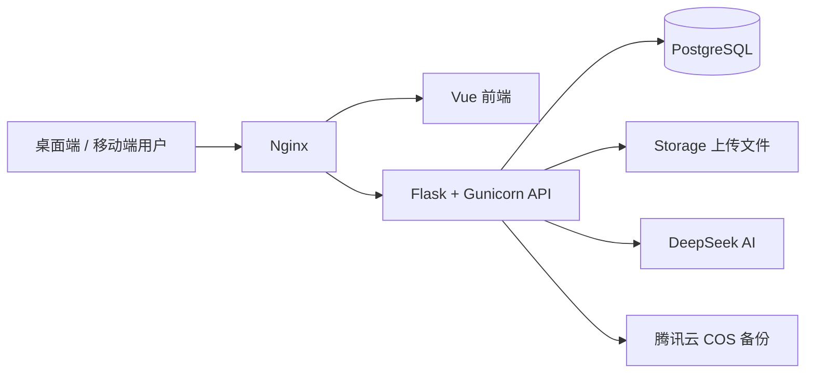
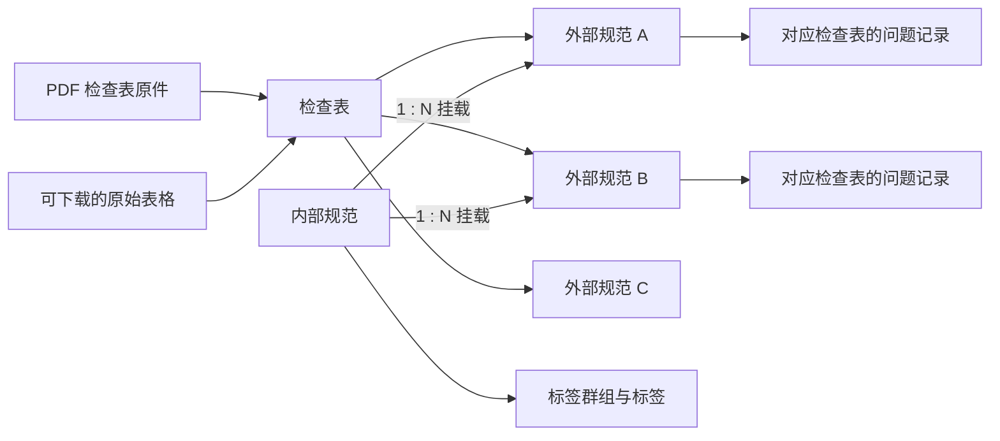
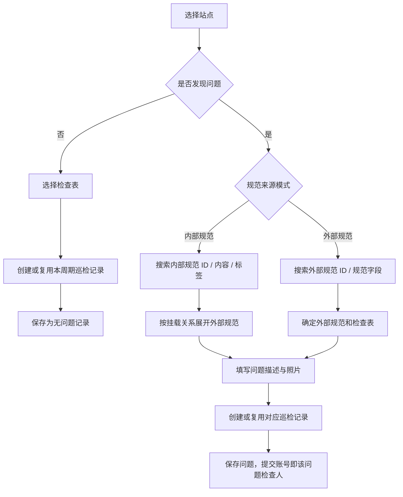
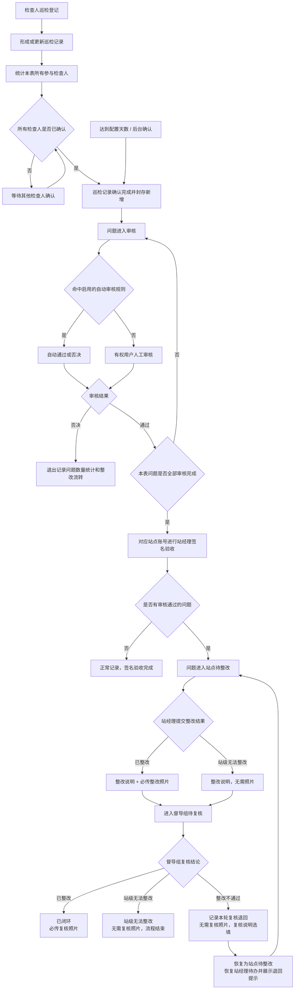
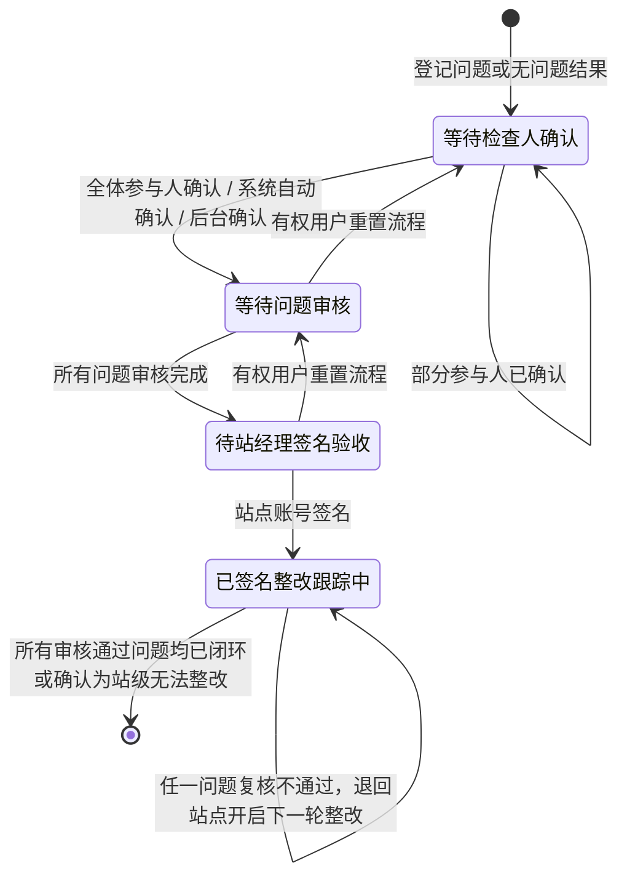
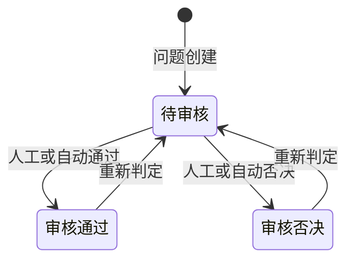
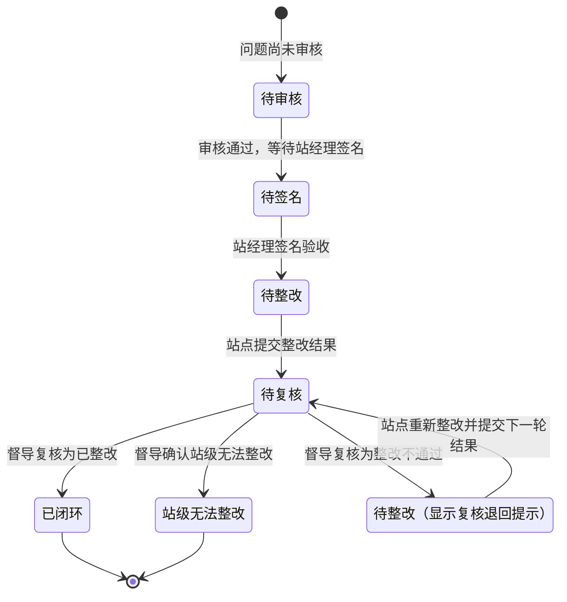
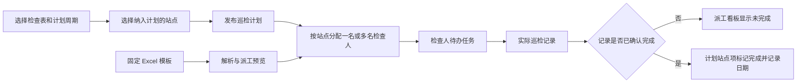
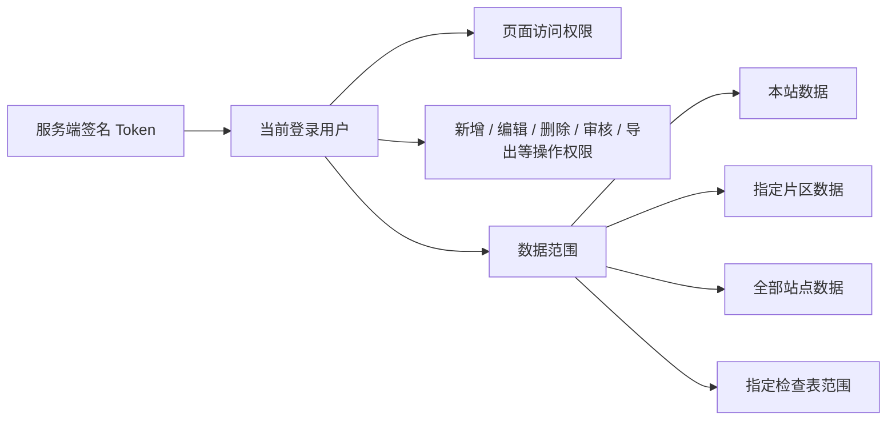

# 业务督导中心数智管理平台

本项目是一套面向业务督导、站点整改和管理分析的综合平台。系统以巡检业务为主线，同时提供考核、培训、站点主数据、数据备份、系统安全和 AI 分析等能力。

> 本文档以当前代码中的实际逻辑为准，重点说明巡检系统的功能和状态流转。

## 文档导航

- [技术架构](#技术架构)
- [系统功能全景](#系统功能全景)
- [巡检系统](#巡检系统)
- [巡检主流程](#巡检主流程)
- [权限与数据范围](#权限与数据范围)
- [数据一致性与追溯](#数据一致性与追溯)
- [本地运行与验证](#本地运行与验证)
- [AI 报告记忆与生成日志](docs/report-ai-memory.md)

## 技术架构



| 层级 | 主要技术 | 职责 |
| --- | --- | --- |
| 前端 | Vue 3、Vue Router、Axios、Vite | 页面交互、权限导航、移动端适配 |
| 后端 | Flask、Gunicorn | 身份校验、业务规则、文件处理、后台任务 |
| 数据库 | PostgreSQL、Flask-Migrate / Alembic | 业务数据、权限、状态和历史记录 |
| 文件 | 本地 Storage、腾讯云 COS | 问题照片、整改照片、原件、材料和备份 |
| AI | DeepSeek 兼容 API | 规范匹配、反馈标题、报告分析和文稿生成 |

## 系统功能全景

```mermaid
flowchart TB
    ROOT[业务督导中心数智管理平台]

    ROOT --> MAP[地图中心]
    ROOT --> INS[巡检系统]
    ROOT --> ASS[考核系统]
    ROOT --> TRA[培训系统]
    ROOT --> PUB[公共功能]
    ROOT --> MGT[管理系统]

    INS --> REG[巡检登记]
    INS --> ISTD[巡检规范库（内部）]
    INS --> ESTD[检查表原件库（外部）]
    INS --> ISSUE[巡检问题列表]
    INS --> RECORD[巡检记录]
    INS --> MINE[我的待整改 / 待复核]
    INS --> PLAN[巡检计划与派工]
    INS --> REPORT[AI 报告生成]
    INS --> CERT[证照管理]

    ASS --> ATT[人员出勤]
    ASS --> SCORE[站点评分]
    ASS --> PEER[成员互评]

    TRA --> MATERIAL[培训材料库]
    PUB --> FEEDBACK[系统反馈]

    MGT --> USER[用户与权限]
    MGT --> STATION[站点数据]
    MGT --> CHECKLIST[检查表数据]
    MGT --> INTERNAL[内部规范数据]
    MGT --> COMPLETE[巡检封存管理]
    MGT --> AUTOAUDIT[白名单自动审核]
    MGT --> SECURITY[系统安全]
    MGT --> BACKUP[数据备份]
```



## 巡检系统

### 核心业务对象

| 对象 | 含义 | 关键关系 |
| --- | --- | --- |
| 站点 | 巡检和整改的业务主体 | 关联片区、站点账号、证照、计划和巡检记录 |
| 检查表 | 来自外部原件的结构化检查内容 | 每张表包含动态字段和多条外部规范 |
| 外部规范 | 由检查表原件拆解得到的规范 | 每条拥有全局唯一的外部规范 ID |
| 内部规范 | 业务督导中心归纳形成的巡检规范 | 一条内部规范可挂载多条外部规范 |
| 巡检记录 | 某站点在某个周期内对某张检查表的一次巡检载体 | 一条记录可包含多个问题和多名检查人 |
| 巡检问题 | 检查人引用规范后登记的实际问题 | 必须归属站点、检查表、外部规范、巡检记录和提交人 |
| 巡检计划项 | 某张检查表在计划周期内对某站点的任务 | 可分配多名检查人，通过已确认完成的巡检记录判定完成 |

### 规范体系与引用逻辑



规范引用遵循以下原则：

1. 外部规范始终归属一张具体检查表，是问题进入巡检记录和报告统计的最终落点。
2. 一条内部规范可同时挂载多条外部规范，但一条外部规范不能同时归属多条内部规范。
3. 使用内部规范登记时，系统按挂载关系展开为对应的外部规范问题。一条内部规范挂载多条外部规范时，可在不同检查表记录下生成对应问题。
4. 问题列表同时展示内部与外部规范信息；巡检记录仍以外部规范和检查表为统计依据。
5. 系统可在管理端切换巡检登记使用内部规范还是外部规范。

### 巡检登记

巡检登记分为“发现问题”和“未发现问题”两种入口：



登记阶段的主要规则：

1. 默认按“自然月”控制同站点、同检查表的巡检记录唯一周期；管理员可改为自然周、自然季度或自然年。
2. 在当前周期的记录尚未确认完成时，后续提交会继续进入同一条巡检记录，不会重复新建。
3. 记录确认完成后，当前周期不再允许新增问题；进入新周期后可创建新记录。
4. 同一条巡检记录可包含多名检查人。每条问题的检查人是实际提交该问题的账号，不会统一挂到第一名检查人。
5. 问题照片支持选择、拖拽和粘贴，最多选取 3 张后进行裁剪、位置调整、画圈标注和自动拼接；最终以一张合成图保存。
6. 页面提供本地草稿自动保存和恢复，会话即将过期时会提前提示用户。

## 巡检主流程

### 端到端流程图



### 巡检记录状态



记录确认与封存规则：

| 规则 | 系统行为 |
| --- | --- |
| 多人参与 | 任意一人确认只记录本人进度，必须所有参与检查人均确认后才算完成 |
| 自动确认 | 默认超过 7 天自动确认；管理员可设置 1-31 天或关闭自动确认 |
| 完成效果 | 封存当前周期的新增入口，同步巡检计划任务完成情况，然后才允许问题审核 |
| 已有问题编辑 | 检查人确认完成本身不会取消已有问题的编辑权；问题审核后则需先重置为待审核才能继续编辑 |
| 流程重置 | 只有具备“重置巡检记录流程”权限的用户可操作，并会清除关联问题的审核结果 |
| 签名后限制 | 站经理签名验收后不允许再重置巡检记录流程 |
| 删除记录 | 删除巡检记录会级联删除该记录下的巡检问题，并重新计算相关计划完成状态 |

### 问题审核状态



1. 问题所属巡检记录尚未确认完成时，不允许审核。
2. 自动审核只使用唯一外部规范 ID 进行全匹配，所有规则平级，可分别配置自动通过或自动否决。
3. 审核否决的问题不参与巡检记录异常数量、整改复核流转和后续报告数据。
4. 审核否决时系统会取消该问题的“优秀问题”标记。
5. 问题一旦审核，提交人的通用编辑与删除权限暂停；审核人重置为待审核后才可再次编辑。

### 单条问题整改复核状态

问题在“审核状态”之外，还有一套用于站点整改和督导复核的业务状态。页面会结合审核和巡检记录签名状态，展示用户容易理解的文案。



| 操作阶段 | 可选结果 | 说明要求 | 照片要求 | 下一状态 |
| --- | --- | --- | --- | --- |
| 站点整改 | 已整改 | 必填 | 必传整改照片 | 待复核 |
| 站点整改 | 站级无法整改 | 必填 | 无需照片 | 待复核 |
| 督导复核 | 已整改 | 选填 | 必传复核照片 | 已闭环 |
| 督导复核 | 站级无法整改 | 选填 | 无需照片 | 站级无法整改，流转结束 |
| 督导复核 | 整改不通过 | 选填，建议说明退回原因 | 无需照片 | 待整改，恢复站经理待办 |

> 页面统一展示“站级无法整改”；数据库为兼容历史数据，仍将其规范化保存为内部状态“站经无法整改”。

整改复核记录遵循以下原则：

1. 每次“提交整改”和“提交复核”都写入独立历史记录，保留轮次、操作人、时间、前后状态、结果、说明和照片。
2. “整改不通过”不是终态：问题从“待复核”恢复为“待整改”，重新出现在对应站点账号的待办中，并显示上一轮退回原因和退回时间。
3. 站点重新提交整改时进入下一轮“待复核”；当前复核展示字段会为新一轮清空，但上一轮结果、说明和照片（如有）继续保存在历史记录中。
4. 巡检记录只有在全部审核通过问题都“已闭环”或被确认“站级无法整改”后，才完成整改跟踪；存在被退回或待复核问题时仍处于跟踪中。
5. “我的待整改 / 待复核”和“巡检问题列表”均可查看完整流转时间线，站点账号只能处理本站被退回的问题。

### 巡检计划与派工



计划逻辑：

1. 计划只有未完成和已完成，不存在草稿状态；创建后即生效，但可随时修改。
2. 同一张检查表的月度、季度和年度覆盖计划不并存；切换周期需经用户确认。
3. 一个站点任务可分配多名检查人，分配时间和人员都会保存，用于派工看板和待办提醒。
4. 线上检查表不能向“监控未运行”的站点派发视频巡检任务；线下检查表不受此限制。
5. 计划任务的完成依据是计划时间段内同站点、同检查表的巡检记录已确认完成，而不是简单的手工勾选。
6. 管理计划、检查表范围和片区范围均受服务端权限校验。

### 主要页面与职责

| 页面 | 主要职责 |
| --- | --- |
| 巡检登记 | 选择站点、引用内部或外部规范、登记问题或无问题结果 |
| 巡检规范库（内部） | 查看内部规范、标签和所挂载的外部规范，支持筛选和 PDF 导出 |
| 检查表原件库（外部） | 预览 PDF 原件，下载原始表格，查看和导出检查表拆解得到的外部规范 |
| 巡检问题列表 | 按数据范围查询问题，审核、编辑、删除、更换检查人、设置优秀问题、查看整改退回状态与完整流转记录、后台导出 |
| 巡检记录 | 按站点与检查表查看检查结果、参与人进度、问题审核进度、站经理签名和整改进度 |
| 我的待整改 / 待复核 | 站点账号处理首次或复核退回的待整改问题并查看退回原因；督导账号以已整改、站级无法整改或整改不通过提交复核 |
| 巡检计划 | 查看计划总览、历史完成情况、任务分配、派工看板和个人待办 |
| AI 报告生成 | 按报告类型和时间范围汇总已完成记录与审核通过问题，异步生成报告并导出 PPT |
| 证照管理 | 维护站点证照有效期，按证照规则生成正常、推荐提醒、法定提醒和已过期状态 |

### 管理端对巡检系统的支撑

| 管理功能 | 作用 |
| --- | --- |
| 检查表数据管理 | 新建、编辑、删除检查表，维护动态字段和外部规范 |
| 巡检规范库数据管理 | 维护内部规范、标签群组、标签和外部规范挂载关系 |
| 巡检封存管理 | 配置记录唯一周期、自动确认天数，查看并管理巡检记录完成状态 |
| 白名单自动审核管理 | 按唯一外部规范 ID 设置平级的自动通过 / 否决规则，并提供回溯导出 |
| 用户数据管理 | 分配页面、操作、数据范围、检查表范围和片区范围权限 |
| 页面显示管理 | 全局显示或隐藏页面；某子系统下页面全部隐藏时，同步隐藏子系统菜单 |

## 权限与数据范围

前端菜单隐藏只用于改善交互，最终安全判断由后端根据签名会话中的当前用户执行。



权限原则：

1. `root` 拥有全部权限，其他角色使用“角色通用权限 + 用户个性化权限”的模式。
2. 用户存在个性化权限时，个性化权限优先于角色通用权限。
3. 本站、片区和全部站点是互斥的主数据范围，可叠加检查表范围限制。
4. 站点账号和片区账号默认不查看待审核问题，只在问题完成审核后进入其可见范围。
5. 检查人姓名和手机号可通过独立权限对特定角色隐藏。
6. 已闭环问题原则上不可修改或删除，只有 `root` 可在必要时使用管理权限处理。

## 数据一致性与追溯

1. 外部规范 ID 是规范的全局唯一标识，已被业务数据引用的规范不允许删除，但可修改内容并在关联页面中同步展示最新内容。
2. 巡检问题保留问题照片，以及每轮实际提交的整改/复核照片和对应时间；“整改不通过”和“站级无法整改”按规则无需复核照片。
3. 整改和复核采用追加历史记录，逐轮保留操作人、状态变化、结果、说明和照片，不会因复核退回或再次提交而丢失上一轮信息。
4. 删除问题会同步更新巡检记录结果和相关计划完成情况；删除巡检记录会级联删除其下问题。
5. AI 报告主要使用已确认完成的巡检记录和审核通过的问题，AI 生成内容在页面和导出结果中应带有明确标识。

## 本地运行与验证

```bash
# 构建并启动本地开发环境，后端启动时会自动应用 Alembic 迁移
docker compose up --build

# 前端构建验证
cd frontend
npm run build

# 后端测试
docker compose run --rm --no-deps backend \
  python -m unittest discover -s tests -p 'test_*.py'

# 检查数据库迁移状态
docker compose exec backend python -m flask db current
docker compose exec backend python -m flask db heads
```

## 文档维护约定

涉及以下变更时，应同步更新本 README：

1. 巡检记录确认、问题审核、签名、整改或复核状态变更。
2. 内部与外部规范映射关系变更。
3. 巡检计划周期、派工或完成判定变更。
4. 巡检页面权限、数据范围或角色默认权限变更。
5. 巡检记录或问题的删除、重置和级联处理规则变更。
